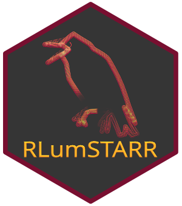

<!-- README.md was auto-generated by README.Rmd. Please DO NOT edit by hand!-->

```{r, echo = FALSE, message=FALSE}
knitr::opts_chunk$set(
  collapse = TRUE,
  comment = "#>",
  fig.path = "man/figures/README-"
)
library(RLumSTARR)
```

# RLumSTARR 

**S**pa**T**i**A**lly **R**esolved **R**adiofluorescence

[](https://www.repostatus.org/#concept)
[](https://cran.r-project.org/package=RLumSTARR)

## Installation

To install the latest development builds directly from GitHub, run

```{r, eval=FALSE}
if(!require("devtools"))
  install.packages("devtools")
devtools::install_github("R-Lum/RLumSTARR@<wanted branch>")
```

## License

This program is free software: you can redistribute it and/or modify
it under the terms of the GNU General Public License as published by
the Free Software Foundation, either version 3 of the License, or
any later version.

This program is distributed in the hope that it will be useful,
but WITHOUT ANY WARRANTY; without even the implied warranty of
MERCHANTABILITY or FITNESS FOR A PARTICULAR PURPOSE. See the
[GNU General Public License](https://github.com/R-Lum/RLumSTARR/blob/master/LICENSE) for more details.

## Funding 

Sebastian Kreutzer received funding from the European Union’s Horizon 2020 research and innovation programme under the Marie Skłodowska-Curie grant agreement No [844457 (project: CREDit)](https://cordis.europa.eu/project/id/844457).

## Related projects 

* [Luminescence](https://github.com/R-Lum/Luminescence)
